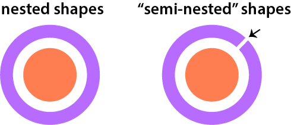
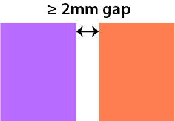
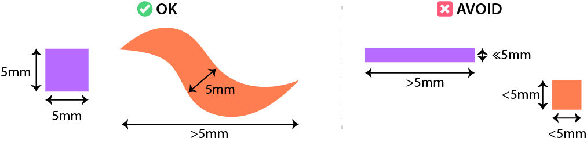

# PolagonStudio

Design tool for 

> *Polagons: Designing and Fabricating Polarized Light Mosaics with User-Defined Color Changing Behaviors*. Ticha Sethapakdi, Laura Huang, Vivian Chan, Lung-Pan Cheng, Fernando Fuzinatto Dall'Agnol, Stefanie Mueller. 

The Processing interface takes input SVG file(s) and converts them into laser cuttable polarized light mosaics made from cellophane. Please refer to the [paper](https://hcie.csail.mit.edu/research/polagons/polagons.html) for more details.

# Requirements
This code requires the following Python3 libraries:
- numpy
- scipy
- pandas
- flask
- matplotlib
- cairosvg

# Running/Using the Software
1. `cd PolagonStudio/backend`
2. Run the Polagon backend script: `python3 polagon_service.py`
3. Open Processing. Make sure you have the `ControlP5` Processing library installed
4. Run the `PolagonStudio` Processing sketch. Save all SVGs to the `data/` folder in the Processing sketch. Fabrication-ready files are saved to `data/cut/`

# Design Guidelines
- **No Nested Shapes**: The process does not support designs that contain nested shapes. However, you can work around this limitation by creating a *semi-nested* shape, which involves adding a small opening or cut in the outer shape.

  
- **Mind the Gaps**: Shapes must not be placed too close together, as this may cause them to unintentionally fuse during the laser cutting process. We recommend maintaining a minimum distance of 2mm between shapes to avoid this issue.

- **Avoid Very Small Shapes**: Very small and/or thin shapes (< 5mm) do not adhere as reliably to the cutting surface as larger ones. This is an inherent limitation of the material and fabrication process, as smaller shapes have a more limited welding area. 

